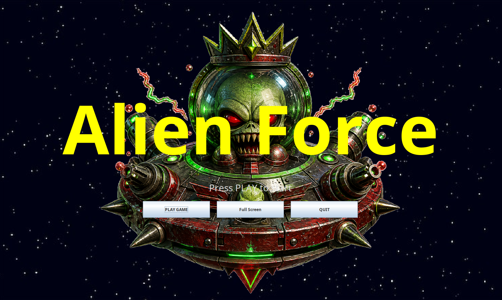

# Alien Force

Alien Force is a Java Swing arcade game inspired by Asteroids. Pilot a ship through 15 increasingly difficult levels of asteroids, aliens, and boss aliens, then compare your score and reached level on a persistent local leaderboard.



## Requirements

- JDK 26
- Maven 3
- `dpkg-deb` when building the Ubuntu package with `./build.sh`

## Build the JAR

```bash
mvn clean package
```

The executable JAR is written to `target/alien-force.jar`.

## Build the Ubuntu package

```bash
./build.sh
```

The script rebuilds the shaded JAR and assembles `target/alien-force_1.1.0-SNAPSHOT_all.deb`, including its command launcher, desktop launcher, and application icon.

## Run

```bash
java -jar target/alien-force.jar
```

## Controls

| Action | Keyboard |
|---|---|
| Thrust | `W` or `Up` |
| Rotate | `A`/`D` or `Left`/`Right` |
| Fire | `Space` or `Z` |
| Super fire (ignores cooldown) | `X` |
| Pause | `Enter` |
| Mute | `M` |
| Toggle fullscreen | `F11` |
| Exit fullscreen | `Escape` |

The first detected JInput-compatible gamepad is also supported. See [Input & Controls](docs/input.md) for the controller mappings.

Destroyed asteroids, aliens, and boss aliens leave moving, expanding, color-changing sprite explosions. Player progress unlocks stronger ship sprites and projectile patterns as the score increases.

Player profiles are stored locally. After a game, **Retry** immediately starts again with the same player, while **Switch User** opens the player-selection dialog.

## Documentation

See the [documentation index](docs/README.md) for architecture, gameplay, UI, audio, and tuning details.
