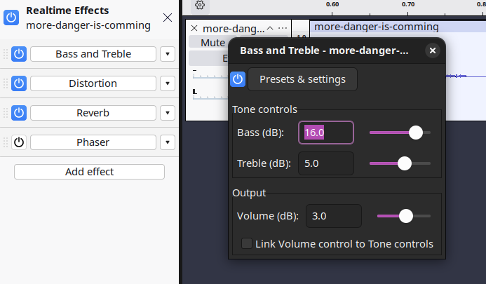
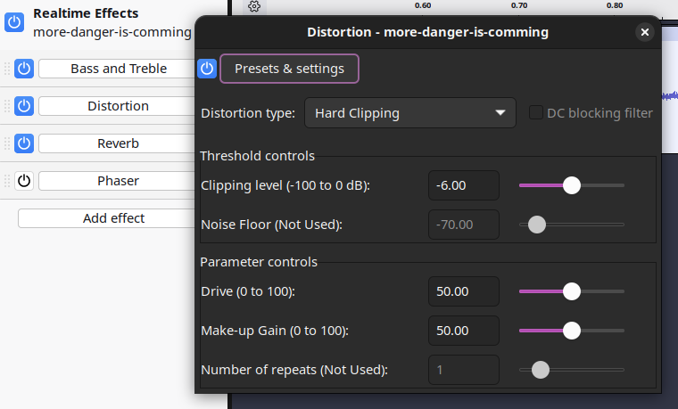
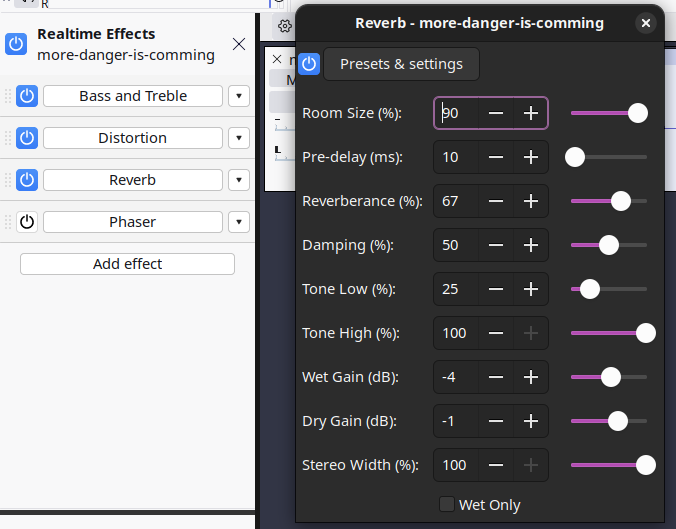

## ESpeak / Audacity

## bash Shell

```shell
[23:12:11] linux-user📁~ ❱ espeak -v en+croak -p 40 -s 160 "More Danger is Coming" -w more-danger-is-comming.wav
[13:21:22] linux-user📁~ ❱ espeak -v en+croak -p 40 -s 160 "Taking on Damage Captain" -w taking-on-damage.wav
```
## Base and Treble Effect



## Distortion Effect



## Reverb Effect

