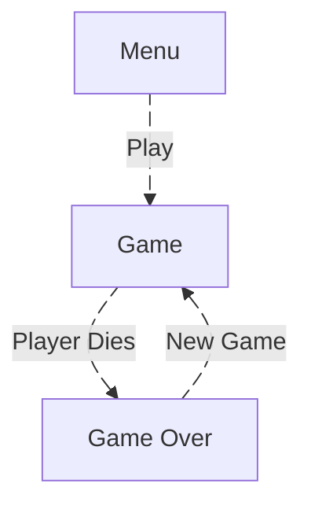

# Screens & UI

The game uses **three screens** managed by a `CardLayout` inside the `Game` JFrame.

## Screen Flow

Both the Menu and Game Over screens have a **QUIT** button that exits the application.

---

## `MenuPanel`

The first screen the player sees.

- **Title**: "Alien Force"
- **Subtitle**: "Press PLAY to start"
- **Buttons**: PLAY GAME, QUIT
- **Music**: Starts looping background music.
- When the user clicks PLAY, `Game.showGame()` is called which:
  - Stops the menu music.
  - Starts the gameplay background music (`background.wav`).
  - Starts the game timer.
  - Gives keyboard focus to the `GamePanel`.

---

## `GamePanel`

The main gameplay screen — a `JPanel` where all the action happens.

### Rendering

1. **Background**: draws `spacebackground.png` stretched to fill the window.
2. **Sprites**: iterates over every `GameObject` in the world, applies an `AffineTransform` to position, rotate, and scale each sprite, then draws it.
3. **HUD**: renders the current score in the top-left corner (white, bold, 24 pt Arial).

### Sprite Transform Pipeline

For each game object, the renderer:

1. Translates to the object's world position.
2. Rotates by `rotationAngle + 270°` (sprites face right by default; this corrects them to face up at angle 0).
3. Scales by the object's `scale` factor.
4. Offsets by half the sprite width/height so the image draws centred on the position.

---

## `GameOverPanel`

Shown when the player dies.

- **Title**: "GAME OVER" (white, bold, 48 pt)
- **Score**: The score from the just-ended round.
- **High Score**: The best score across all rounds in the current session (gold text).
- **Buttons**: NEW GAME (restarts), QUIT (exits).
- **Sound**: A one-shot `level-up.wav` plays when this screen appears.
- The background music is stopped when transitioning here.

---

## Window Configuration

| Setting     | Value                                                        |
|-------------|--------------------------------------------------------------|
| Size        | 1000 × 1000 px (set via panel preferred sizes)               |
| Resizable   | No                                                           |
| Background  | Black (game panel), dark grey-blue `rgb(30, 30, 40)` (menus) |
| Positioning | Centred on screen                                            |
